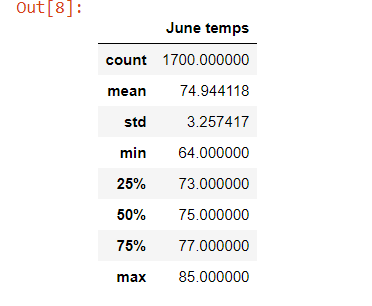
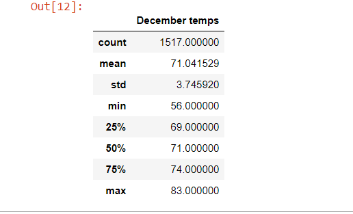
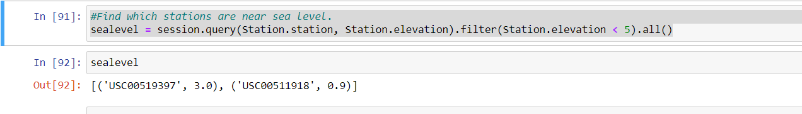
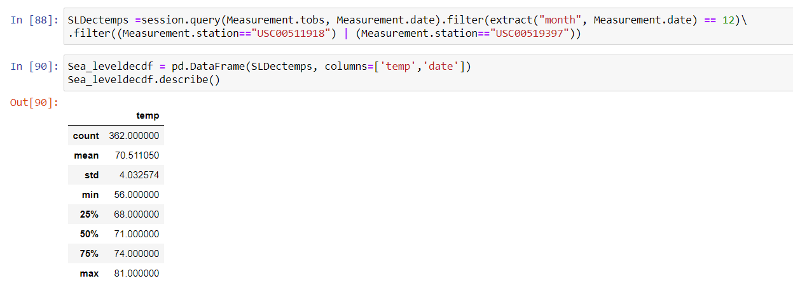
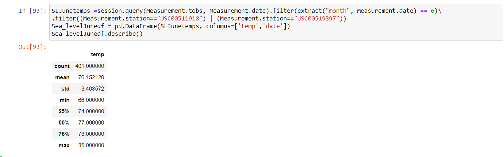

# Surfs up!

## Overview

 In order to determine the year-round viability of a surf and icecream shop in Oahu we will be looking at Summer and Winter temperature trends. We have weather data which includes temperatures taken from several weather stations over several years in a sqllite file. We will query this data to find temperatures for the both the month of June and December. We will then make these results into databases and retrieve summary statistics. This will give us an overview of Summer and Winter temperatures.

## Results

- The mean temperatures are quite close, but they are ~ 4 degres colder in winter. 71 v 75 degrees. 
- We have a greater variation in temps in winter.  This is evidenced by the larger std dev. 
- The max temps are similar ( 83/85  degrees) but the December lows are considerable colder (64/56 degrees)
- If we consider 72 degrees to be room temp. More than 50% of winter readings are lower than this.
-  Where as June has more than 75% of days above room temp. 
- We can also see we have more readings from June than Dec (1700 to 1517). 

## Summary

Oahu remains pretty pleasent year round! A lot depends on what we 
consider a warm day. 

 We can see as expected the weather is cooler in winter.  The mean is 
only 4 degrees lower at 71--but this does place it slightly below standard room temperature (72 degrees).  There are hot days in the winter reaching 83 degrees only slightly cooler than the hottest days of June!  If we consider a pleasent day to be warmer than room temperature (73+) We can see that is around the 25th percentile in summer (most days being warmer), but near 75th percentile in winter(most days colder).

## Further Analysis

Oahu although small, still has microclimates.  It may be that sea-level weather stations have different results than those atop hills. 

 -We can find which stations are close to sea-level with the following query.

 

- We can then make a dataframe for December temps. and find statistics for sea-level stations, with the following:

- The same can be done for June:

